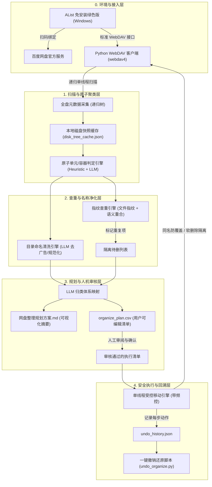

# 百度网盘智能整理系统（LLM-BaiduPan-Organizer）设计与实施方案

---

## 1. 系统设计背景与核心目标

针对百度网盘海量、散乱的文件与目录，建立一套安全、低频控风险、可回溯的智能化整理系统。该系统基于大语言模型（LLM）的语义理解能力，针对“孩子学习、儿童娱乐、成人工作研究、影视剧集”等主线资源实现全自动分析归类、重复资源去重、脏乱文件名净化，并在执行操作前提供人工审核表与撤销日志保障。

### 核心设计原则
1. **零误删与安全隔离**：绝对不调用网盘硬删除 API。所有建议删除的过时资料（如幼教、低龄废弃资料、乐高图纸）及查重副本统一移动至 `_待清理隔离区/`。
2. **原子目录保护**：严格区分“松散容器目录”（如 `学习/`、`网盘备份/`）与“高内聚原子资源单元”（如 `AMC8历年真题/`、`曼达洛人 第一季/`），确保成套资料作为一个整体移动，避免破坏资源内部结构。
3. **两阶段人机协同**：
   - **Phase 1 分析与规划**：扫描并结合大模型生成清晰的 `网盘整理规划方案.md` 与可编辑的 `organize_plan.csv`；
   - **Phase 2 审核与执行**：用户在 Excel/文本编辑器中审阅或微调后，由单线程执行引擎一键安全执行。
4. **单线程防风控与可撤销**：单线程运行，内置 1~2 秒随机延时；每次移动实时写入 `undo_history.json`，提供一键原路还原脚本。

---

## 2. 总体架构与数据流图



---

## 3. 核心功能模块设计

### 模块 1：AList 自动化引导与 WebDAV 适配 (`alist_helper.py`)
- **定位**：解决百度网盘防爬虫、动态 Token 刷新与会话保活问题。
- **职责**：
  - 检测本地 `alist.exe` 是否存在。若无，从官方 GitHub/加速镜像自动下载 Windows 64位绿色单文件版。
  - 提供快速启动管理（启动 AList 并在浏览器打开 `http://localhost:5244`）。
  - 封装统一的 `WebDAVAdapter`，统一调用 `list`, `mkdir`, `move` 等方法。

### 模块 2：目录树扫描与本地持久化缓存 (`scanner.py`)
- **定位**：避免频繁向网盘发请求，实现“一次扫盘、离线分析”。
- **职责**：
  - 递归遍历百度网盘根目录，记录全盘的目录层级、子文件数量、文件大小、文件扩展名等特征。
  - 将整棵目录树序列化保存至本地 `cache/disk_tree_cache.json`。
  - 支持断点续扫与增量刷新。

### 模块 3：原子单元与容器识别引擎 (`atomic_detector.py`)
- **定位**：智能判定“合体不可分割的资源单元”与“需拆解的顶层容器”。
- **识别机制**：
  1. **规则启发过滤**：
     - 若同级子目录呈现连续命名（如 `2001`, `2002`, `2003`，或 `01讲`, `02讲`，或 `S01`, `S02`），判定该父目录为**原子资源单元**。
     - 若父目录名包含明确课程/竞赛/剧集特征（如 `AMC8`, `高思数学`, `新概念英语`, `曼达洛人`），向上锁定为整体包。
  2. **LLM 批量语义裁决**：
     - 将有歧义的父子目录结构（如父目录 `学习`，子目录 `[语文, 数学, 英语]` 或父目录 `各种资料`）交由 LLM 进行打标：`CONTAINER`（需拆开分发）或 `ATOMIC_UNIT`（不可分割包）。

### 模块 4：指纹查重与名称清洗引擎 (`dedup_cleaner.py`)
- **职责**：
  1. **精准查重**：根据目录内部文件总大小、文件数量、核心文件列表的哈希/特征比对。若目录高度重合，判定为“完全重复项”，保留路径更规范的一份，其余标记为 `ISOLATE_DUPLICATE`。
  2. **智能命名净化（LLM）**：
     - 剔除引流水印标签（例如 `【关注公众号：某某幼教】`、`【最新独家一手资源】`、`[XX论坛首发]`）。
     - 将杂乱的目录名规范化，例如将 `AMC8真题解析2000-2023高清无密版` 统一格式化为 `AMC8历年真题及解析(2000-2023)`。

### 模块 5：两阶段规划生成器 (`planner.py`)
- **职责**：
  - 将清洗后的原子单元根据用户设定的目标分类体系分拣：
    - `01_孩子学习/小学/数学/竞赛/`
    - `01_孩子学习/小学/数学/常规/`
    - `01_孩子学习/小学/语文/`
    - `01_孩子学习/小学/英语/`
    - `01_孩子学习/初中/...`
    - `02_儿童听读与娱乐/三国西游评书/...`
    - `03_工作与研究/论文研报/...`
    - `04_影视与音像/美剧/...`
    - `_待清理隔离区/超龄低幼废弃/`
    - `_待清理隔离区/重复副本/`
  - 导出两份审核交付物：
    1. **`网盘整理规划方案.md`**：人类直观阅读的架构图、各类目资源统计、隔离删除理由。
    2. **`organize_plan.csv`**：供用户在 Excel 中直接核对或修改的明细表，字段包含：
       - `source_path`: 原始路径
       - `action`: `MOVE`（移动）、`ISOLATE`（隔离待删）、`KEEP`（原地不动）
       - `target_path`: 建议的目标归档路径
       - `cleaned_name`: 规范化后的目录名
       - `reason`: 归类或隔离建议的理由
       - `status`: 用户确认标记（默认 `CONFIRMED`，用户可改为 `SKIP` 或自定义路径）

### 模块 6：受控单线程执行引擎与回滚器 (`executor.py` / `undo_organize.py`)
- **职责**：
  - 读取用户审核确认后的 `organize_plan.csv`。
  - **防冲突机制**：移动前检查目标路径。若目标已存在同名目录，自动追加 `_副本` 后缀并记录报警日志，严防覆盖。
  - **单线程防封控**：严格单线程顺序调用 WebDAV `MOVE`，每次调用间隔随机延时 1.0 ~ 2.0 秒。
  - **审计与撤销**：每完成一次移动，将 `{source: ..., dest: ..., timestamp: ...}` 写入 `undo_history.json`。若用户需要反悔，运行 `undo_organize.py` 即可原路还原。

---

## 4. 目录与代码拆分结构规范

遵循项目规范（单文件不超过 1500 行，模块清晰、配置外部化）：

```
E:\users\kpan\BaiduSyncdisk\program\aigc\utils\baiduwangpan/
│
├── config.py                 # 全局配置中心（WebDAV端口、频控延时、模型配置等）
├── newapi_key.env            # 大模型 API Key 与端点配置（已就绪）
├── alist_helper.py           # AList 绿色版下载、启动与 WebDAV 基础适配器
├── scanner.py                # 网盘单线程遍历与树状快照生成
├── atomic_detector.py        # 原子目录识别与容器拆解引擎 (规则+LLM)
├── dedup_cleaner.py          # 智能查重与目录名去广告清洗引擎
├── planner.py                # 归类映射规划器（生成 .md 与 .csv）
├── executor.py               # 安全单线程移动执行引擎（防冲突+软隔离）
├── undo_organize.py          # 一键撤销还原工具
├── run_pipeline.py           # 主执行入口命令行工具（支持分阶段逐步运行）
│
├── cache/                    # 运行缓存（全盘树快照等）
│   └── disk_tree_cache.json
└── output/                   # 审核交付与执行日志
    ├── 网盘整理规划方案.md
    ├── organize_plan.csv
    ├── undo_history.json
    └── execution.log
```

---

## 5. 实施与分步落地计划

1. **Step 1：基础配置与 AList WebDAV 环境就绪**
   - 编写 `config.py` 与 `alist_helper.py`。
   - 验证 AList 启动与百度网盘 WebDAV 连通性。
2. **Step 2：扫描与原子检测模块实现**
   - 编写 `scanner.py` 与 `atomic_detector.py`。
   - 接入 `newapi_key.env` 的大模型，实现成套资源与容器目录的准确辨识。
3. **Step 3：查重、净化与两阶段规划输出**
   - 编写 `dedup_cleaner.py` 与 `planner.py`。
   - 生成样例规划文件并在本地验证 `网盘整理规划方案.md` 与 `organize_plan.csv` 的可读性与编辑性。
4. **Step 4：安全单线程执行器与撤销工具实现**
   - 编写 `executor.py` 与 `undo_organize.py`。
   - 进行 Dry-run（仿真运行）测试与冲突规避测试。
5. **Step 5：交付与用户联调**
   - 启动 AList 并由用户扫码绑定百度网盘。
   - 跑通完整流程，输出真实网盘规划报告供用户审核。
