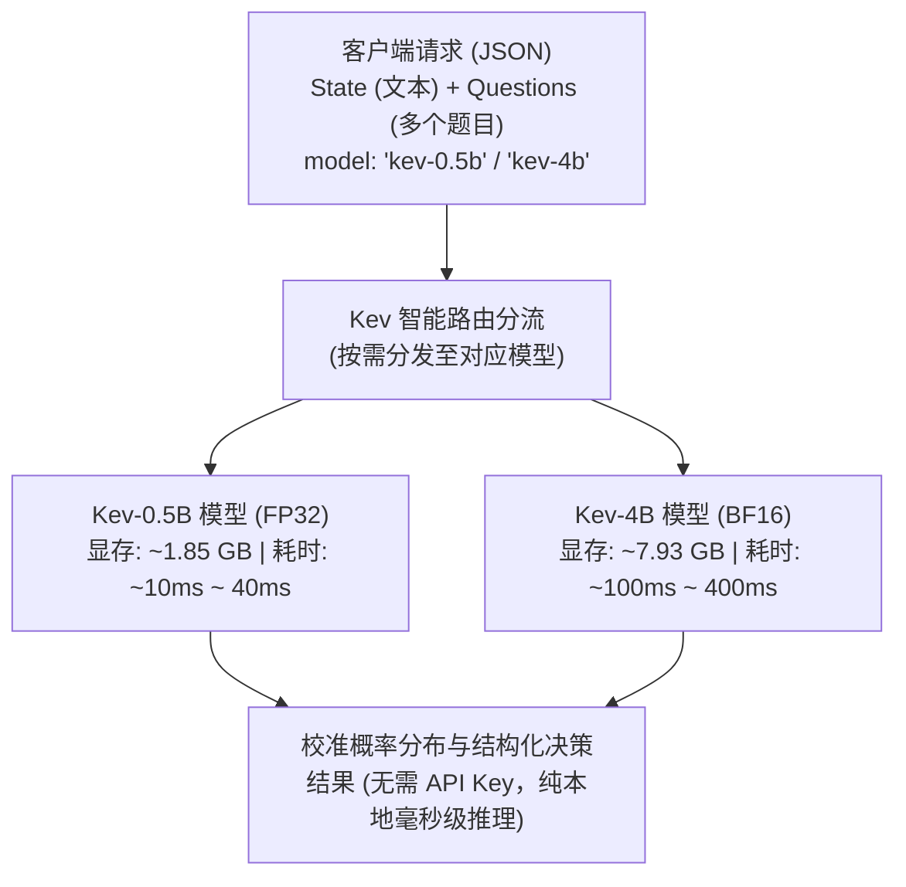

# Kev 本地决策模型开发者与使用指南 (0.5B / 4B / Hybrid 双模型并发)

> **运行环境已全面就绪**：
> - 硬件环境：NVIDIA GeForce RTX 4070 Ti SUPER (16 GB GDDR6X 显存) + CUDA 12.8
> - 运行时：本地独立 GPU 嵌入式 Python 环境（`F:\BaiduNetdiskDownload\Z_image_turbo_v2.0\Z_image_turbo_v2.0\python_embeded\python.exe`）
> - 模型存储：**100% 存放在本地 E: 盘项目目录**，已通过环境变量与配置彻底隔离，绝不污染或占用 Windows C 盘空间。
> - 运行模式：全面支持 **0.5B (极速型)**、**4B (高精型)** 单模型独立运行，以及 **Hybrid (双模型同时常驻显存分开调用)**。

---

## 一、 系统架构与双模型支持

Kev 是对 TypeSafe Jev 决策模型的轻量级纯本地复现。与自回归打字生成式 LLM 不同，Kev 采用前向因果块掩码与指针头（Pointer Head）架构，**不生成文本，一次前向计算直接输出所有题目的概率分布**。



---

## 二、 GPU 显存与双模型并发可行性评估

用户关心系统 GPU（RTX 4070 Ti SUPER 16GB）能否在合理范围内同时运行两个模型。实测数据与评估如下：

### 1. 显存实测占用数据
| 模型 / 组件 | 加载精度 | 单独显存占用 | 混合模式常驻显存 | 性能特点与适用场景 |
| :--- | :--- | :--- | :--- | :--- |
| **Kev-0.5B** | FP32 | 1,895 MB (~1.85 GB) | 1,895 MB | 极速响应，适合 QPS > 100 的粗筛与简单分类 |
| **Kev-4B** | BF16 | 8,124 MB (~7.93 GB) | 8,124 MB | 语义深层推理，适合复杂多标签与关键风控决策 |
| **双模型常驻总计** | 混合 | - | **10,019 MB (~9.78 GB)** | **显存占用率 61.2%**，剩余空间充裕（**6.22 GB**） |

> [!TIP]
> **评估结论**：**完全在极度安全、合理的范围内支持！**
> 16 GB 显存中，双模型权重与 KV 缓存仅占 9.78 GB，剩余高达 6.22 GB 的空间完全可以从容应对 Windows 桌面显示开销、长文本上下文（8192 tokens）与高并发请求队列，绝不会发生 CUDA Out of Memory (OOM)。

---

## 三、 本地模型权重存储规范（严禁写入 C 盘）

所有模型权重均已存放在本地工程目录下，严禁下载到 C 盘：

```
E:\users\kpan\BaiduSyncdisk\program\aigc\jev\kev\
├── models/
│   ├── qwen3.5-4b-base/                     # Qwen3.5-4B 基础模型完整权重 (8.7 GB)
│   ├── modelscope_cache/                    # ModelScope 阿里云国内加速缓存
│   └── hf_cache/                            # HuggingFace 缓存重定向目录
│       └── hub/
│           ├── models--Qwen--Qwen2.5-0.5B/   # 0.5B 基础模型
│           ├── models--jaredpalmer--kev-0.5b/# Kev-0.5B LoRA 适配层与指针头
│           ├── models--Qwen--Qwen3.5-4B-Base/# 4B 基础模型快照硬链接 (零空间冗余)
│           └── models--jaredpalmer--kev-4b/  # Kev-4B LoRA 适配层与指针头
```

通过脚本强制注入 `$env:HF_HOME`、`$env:HF_HUB_CACHE` 与 `$env:MODELSCOPE_CACHE`，彻底切断所有向 `C:\Users\...\.cache` 写入的路径。

---

## 四、 启动 CLI、环境配置与 .env 文件

项目支持标准的 `.env` 环境变量外部化配置，配置读取优先级为：
`命令行参数 > .env 环境变量 > kev_config.json > 默认值`。

### 1. 核心环境变量配置文件 [.env](file:///E:/users/kpan/BaiduSyncdisk/program/aigc/jev/kev/.env)
```bash
# 服务网络与运行模式
KEV_HOST=127.0.0.1
KEV_PORT=8008
KEV_BASE_URL=http://127.0.0.1:8008
KEV_MODEL=hybrid
KEV_DEFAULT_MODEL=4b
KEV_DEVICE=cuda
KEV_DTYPE=bf16

# 本地模型缓存目录 (严格限制在本目录，严禁写入 C 盘)
HF_HOME=E:\users\kpan\BaiduSyncdisk\program\aigc\jev\kev\models\hf_cache
HF_HUB_CACHE=E:\users\kpan\BaiduSyncdisk\program\aigc\jev\kev\models\hf_cache\hub
MODELSCOPE_CACHE=E:\users\kpan\BaiduSyncdisk\program\aigc\jev\kev\models\modelscope_cache
KEV_PYTHON_PATH=F:\BaiduNetdiskDownload\Z_image_turbo_v2.0\Z_image_turbo_v2.0\python_embeded\python.exe

# 性能调优与国内加速
HF_ENDPOINT=https://hf-mirror.com
KEV_PREFIX_CACHE=4
KEV_PREFIX_MIN_TOKENS=384
KEV_MERGE=1
```

### 2. 命令行启动方式（CLI 参数配置）

通过 PowerShell 脚本 [run_kev.ps1](file:///E:/users/kpan/BaiduSyncdisk/program/aigc/jev/kev/run_kev.ps1) 快速启动：

```powershell
# 1. 启动 Hybrid 双模型混合模式（默认推荐，0.5B 与 4B 同时常驻，分开调用）
powershell -ExecutionPolicy Bypass -File "E:\users\kpan\BaiduSyncdisk\program\aigc\jev\kev\run_kev.ps1" -Model hybrid

# 2. 仅运行 4B 高精模型 (占用显存 ~8GB)
powershell -ExecutionPolicy Bypass -File "E:\users\kpan\BaiduSyncdisk\program\aigc\jev\kev\run_kev.ps1" -Model 4b

# 3. 仅运行 0.5B 极速模型 (占用显存 ~1.85GB)
powershell -ExecutionPolicy Bypass -File "E:\users\kpan\BaiduSyncdisk\program\aigc\jev\kev\run_kev.ps1" -Model 0.5b

# 4. 指定端口启动
powershell -ExecutionPolicy Bypass -File "E:\users\kpan\BaiduSyncdisk\program\aigc\jev\kev\run_kev.ps1" -Model hybrid -Port 8009
```

亦可直接使用 Python 启动服务：
```powershell
& "F:\BaiduNetdiskDownload\Z_image_turbo_v2.0\Z_image_turbo_v2.0\python_embeded\python.exe" "E:\users\kpan\BaiduSyncdisk\program\aigc\jev\kev\serve.py" --model hybrid --port 8008
```

---

## 五、 调用方法与分开调用说明

服务监听于 `http://127.0.0.1:8008`，兼容 TypeSafe System One 协议，**无须 API Key**。

### 1. 查询当前在线模型 (`GET /v1/models`)
```bash
curl http://127.0.0.1:8008/v1/models
```
返回示例：
```json
{
  "models": [
    {"id": "0.5b", "base": "Qwen/Qwen2.5-0.5B", "device": "cuda"},
    {"id": "4b", "base": "Qwen/Qwen3.5-4B-Base", "device": "cuda"},
    {"id": "kev-0.5b", "base": "Qwen/Qwen2.5-0.5B", "device": "cuda"},
    {"id": "kev-4b", "base": "Qwen/Qwen3.5-4B-Base", "device": "cuda"},
    {"id": "kev-latest", "base": "Qwen/Qwen3.5-4B-Base", "device": "cuda"}
  ]
}
```

### 2. 在混合模式下分开调用两种模型

在同一个服务端口下，客户端无需重启服务，通过以下两种方式之一即可分开调度对应模型：

#### 方式 A：请求体字段路由（推荐，完全兼容官方 SDK）
向 `POST http://127.0.0.1:8008/v1/systemone` 发送请求时指定 `model` 字段：
- 调度 0.5B 模型：`"model": "kev-0.5b"`（或 `"0.5b"`）
- 调度 4B 模型：`"model": "kev-4b"`（或 `"4b"`）
- 缺省或 `"kev-latest"`：自动使用默认配置的高精 4B 模型。

#### 方式 B：显式 URL 路由
- 显式调用 0.5B：`POST http://127.0.0.1:8008/v1/models/0.5b/systemone`
- 显式调用 4B：`POST http://127.0.0.1:8008/v1/models/4b/systemone`

---

## 六、 实测对比报告 (0.5B vs 4B)

测试输入（严重客诉文本）：
> *"The order arrived 5 days late, package was ripped open, and 1 item is missing. I want an immediate refund."*
> （订单迟到了5天，包裹被撕开，少了一件商品。我要求立即全额退款。）

| 维度 / 判定项 | Kev-0.5B (极速型) | Kev-4B (高精型) | 表现差异分析 |
| :--- | :--- | :--- | :--- |
| **首包推理纯耗时** | **39.38 ms** | **126.04 ms** | 0.5B 延迟极低，4B 仍在人类无法感知的 0.1 秒级 |
| **诉求分类 (Category)** | `refund_request` (置信度 0.23) | `refund_request` (**置信度 0.47**) | 4B 置信度更显著，对复合诉求的辨别更果断 |
| **紧急人工介入 (is_urgent)**| 45.00% (判定犹豫，倾向否) | **100.00%** (**果断识别为极度紧急**) | 4B 准确抓住了破损少件与退款的高危信号 |
| **愤怒评分 (Score 0~2)** | 0.91 (偏温和，中度不满) | **1.99** (**精准打满分，极度愤怒**) | 4B 对用户强烈负面情绪的捕捉能力质变 |

---

## 七、 客户端调用 Python 代码

完整代码位于 [examples/api_examples.py](file:///E:/users/kpan/BaiduSyncdisk/program/aigc/jev/kev/examples/api_examples.py)。

```python
import json
import urllib.request

SERVER_URL = "http://127.0.0.1:8008/v1/systemone"

def predict(state_text, model_name="kev-4b"):
    payload = {
        "state": state_text,
        "model": model_name,  # 'kev-0.5b' 或 'kev-4b'
        "questions": {
            "category": {
                "type": "choice",
                "instructions": "Classify the ticket category:",
                "criteria": {
                    "refund": "Money back request",
                    "delay": "Shipping delay",
                    "damage": "Package damaged"
                }
            },
            "is_urgent": {
                "type": "noul",
                "instructions": "Is this ticket urgent?"
            }
        }
    }
    
    req = urllib.request.Request(
        SERVER_URL,
        data=json.dumps(payload).encode("utf-8"),
        headers={"Content-Type": "application/json; charset=utf-8"},
        method="POST"
    )
    with urllib.request.urlopen(req) as resp:
        return json.loads(resp.read().decode("utf-8"))

# 分别调用两个模型对比
res_4b = predict("Order broken and missing!", model_name="kev-4b")
print("4B 预测结果:", res_4b["answers"], f"耗时: {res_4b['latency_ms']}ms")

res_05 = predict("Order broken and missing!", model_name="kev-0.5b")
print("0.5B 预测结果:", res_05["answers"], f"耗时: {res_05['latency_ms']}ms")
```

---

## 八、 Hybrid 双模型自动化测试脚本

项目自带完整的端到端自动化测试套件 [test_hybrid.ps1](file:///E:/users/kpan/BaiduSyncdisk/program/aigc/jev/kev/test_hybrid.ps1)（底层驱动脚本为 [scripts/test_hybrid_api.py](file:///E:/users/kpan/BaiduSyncdisk/program/aigc/jev/kev/scripts/test_hybrid_api.py)）。

### 测试内容覆盖：
1. **服务健康与模型在线探测**：请求 `GET /v1/models`，校验 0.5b 与 4b 是否都在显存注册就绪；
2. **同题决策质量对比**：同时评测 Choice 分类、Noul 是非、Score 打分三大核心题型并对比两模型决策差异与置信度；
3. **显式 URL 路由隔离验证**：验证 `/v1/models/0.5b/systemone` 与 `/v1/models/4b/systemone` 是否绝对隔离；
4. **交替压测与前缀缓存 (Prefix KV Cache) 验证**：模拟真实高并发下双模型交替轮流请求，验证显存稳定性及二次相同文本状态下的缓存加速比；
5. **异常容错测试**：针对非法模型名（404 容错）和非法数据格式（422 容错）的防御检验。

### 执行方式：
```powershell
# 一键运行测试（自动读取 .env 配置）
powershell -ExecutionPolicy Bypass -File "E:\users\kpan\BaiduSyncdisk\program\aigc\jev\kev\test_hybrid.ps1"

# 临时指定测试端口
powershell -ExecutionPolicy Bypass -File "E:\users\kpan\BaiduSyncdisk\program\aigc\jev\kev\test_hybrid.ps1" -Url "http://127.0.0.1:8008"
```

